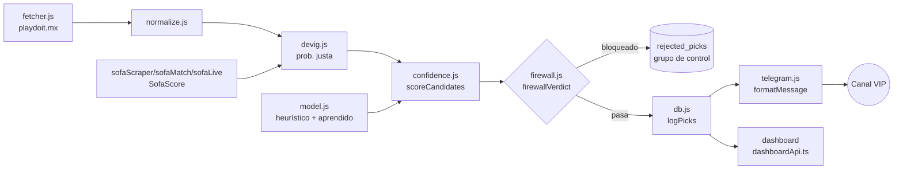
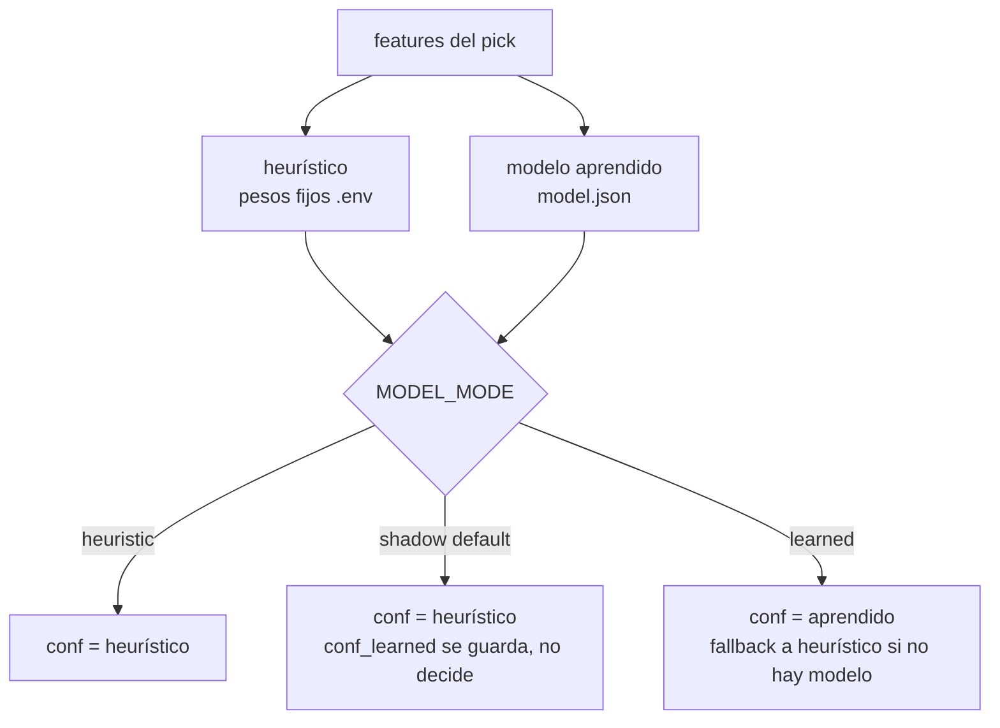

# Reporte 1 — Arquitectura y flujo de toma de decisiones

> Ver [contexto-tecnico.md](contexto-tecnico.md) para el mapa completo de módulos. Este reporte narra el **flujo en vivo**: de la cuota cruda al pick entregado.

## 1. Vista general

`sharp.js` no está en la ruta de decisión: corre aparte, comparando el pick ya calculado contra casas de referencia para auditar el edge, no para filtrarlo.

## 2. Etapas

### 2.1 Ingesta (`fetcher.js`, `sofa*.js`)
Muestreo periódico de cuotas en vivo (todas las líneas y deportes) más estadísticas de SofaScore (córners, progreso del partido). `normalize.js` alinea nombres de equipos/mercados entre ambas fuentes antes de cruzarlas.

### 2.2 Probabilidad justa (`devig.js`)
Remueve el margen de la casa de la cuota cruda → probabilidad "justa" del evento. Es la feature `f_prob_justa`, la única con correlación positiva confiable con acertar (ver §4).

### 2.3 Scoring (`confidence.js` + `model.js`)
`scoreCandidates` combina las features del pick (`f_prob_justa`, `f_avance`, `f_situacion`, `f_linea`, features de mercado) en una confianza (`conf`). La fuente de esa confianza depende de `MODEL_MODE`:

**`shadow` es el modo de producción por defecto.** El aprendido nunca decide solo — corre en paralelo y su salida (`conf_learned`) se persiste para auditar, no para actuar. Ver [model-adoption-incident](../memory/model-adoption-incident.md): la única vez que corrió en `learned` infló la confianza y el sizing tipo Kelly multiplicó el stake sobre eso.

`rankPicks`/`safestPicks`/`goldenPick`/`parlayCombos`/`rescuePicks` (todos en `confidence.js`) consumen ese `conf` para producir las distintas vistas que expone Telegram (`/top`, `/seguras`, `/golden`, `/parlay`).

### 2.4 Firewall (`firewall.js`)
Filtro duro, posterior al scoring, que **quita daño, no crea edge** (pasa de ROI −3.5% a −1.0%, reteniendo 87% del volumen — cifras fuera de muestra, ver cabecera del módulo). Reglas activas por defecto:

| Regla | Qué bloquea | Motivo (resumen) |
|---|---|---|
| R1 | Mercado "Más de" (Over) | ROI −22% fuera de muestra, pierde en todos los tramos |
| R2 | Avance de partido bajo (<0.40) | Muy solapada con R1 (mismo conjunto) |
| R7 | Under con línea > 3.5 | Edge de Under se concentra en líneas bajas; la cola no pierde, pero no aporta y suma varianza |

R3/R4/R5 existen pero R3 es inerte (rankPicks ya acota antes) y R4 nace desactivada (el bucket que debía bloquear en realidad es positivo). R6 quedó desactivada tras descubrir que medía el scanner de empates, no un fenómeno de mercado (ver §4 y [global-draw-fabricated-features](../memory/global-draw-fabricated-features.md)). Todo el módulo es reversible por `.env` (`FIREWALL_ENABLED=false`).

Un pick bloqueado no se descarta: se registra en `rejected_picks`, el **grupo de control** — ver [grupo-control-rechazados](../memory/grupo-control-rechazados.md). Es la única forma de medir si el firewall está dejando pasar dinero en la mesa.

Dentro de lo que pasa, `isElite` marca un subconjunto más estrecho (Under, avance≥0.75, línea≥0.55) como el único bucket con ROI positivo fuera de muestra medido hasta ahora (+11.8%, N=37 — muestra chica, orientativo).

### 2.5 Persistencia y emisión (`db.js`, `telegram.js`, `betlink.js`, `badgeStats.js`)
Lo que pasa el firewall se registra (`logPicks`) y se formatea para Telegram con un enlace de apuesta directa (`betlink.js`) y badges descriptivos calculados sobre el histórico completo (`badgeStats.js` — desde commit `b3e07b2`, los badges describen el pick en vez de prometer rendimiento, ver `99ce4b1`).

### 2.6 Liquidación y auditoría (`results.js`, `metrics.js`, `health.js`, dashboard)
`processSettlements` liquida picks contra el resultado real. `metrics.js`/`health.js` calculan ROI, calibración y drift. El dashboard (`dashboard/` + `dist/server/dashboardApi.js`) expone todo esto para revisión post-hoc — nunca interviene en la decisión en vivo.

## 3. Ciclo de comandos de Telegram

`bot.js` es el orquestador: adquiere el candado de instancia única (`singleInstance.js` — ver [two-windows-accounts](../memory/two-windows-accounts.md)), corre el ciclo de muestreo/emisión, y atiende comandos (`/top`, `/seguras`, `/golden`, `/parlay`, `/stats`, `/health`, `/unidades`, `/pick`, `/dia`, `/validar`, `/train`, `/reboot`, `/pendientes`). **No hay control de acceso**: cualquier chat que hable con el bot recibe respuesta — ver [no-telegram-auth-gate](../memory/no-telegram-auth-gate.md).

## 4. Decisiones de arquitectura que vale la pena señalar

- **Una sola fuente de verdad para features de mercado** (`marketFeatures()` en `model.js`): Node las calcula una vez y el exportador del dataset a Python las reutiliza tal cual, para que entrenamiento y producción nunca puedan divergir en cómo se derivan (evita el train/serve skew que ya costó reconstruir 2228 filas de `f_avance`).
- **`f_avance` vs `f_avance_model`**: la misma noción (progreso del partido) vive en dos escalas distintas según quién la consuma (firewall usa `progress` crudo, el modelo usa `1 - progress` para ciertos Over). Documentado en la cabecera de `firewall.js` para que no se mezclen.
- **Confianza cruda vs calibrada** (`learnedRaw` vs `learnedConf`): la calibración isotónica es una escalera de ~28-30 peldaños que aplasta el orden fino (94.8% de los picks que superan `MIN_CONF` caían en 2 peldaños indistinguibles — ver [calibracion-isotonica-colapso](../memory/calibracion-isotonica-colapso.md)). El crudo se usa para ordenar, el calibrado para leer como probabilidad.
- **Fallback de feature ausente**: para binarios de mercado es 0 (no 0.5), porque 0.5 fue el origen del mismo tipo de skew mencionado arriba.

## 5. Qué queda fuera de este reporte

Arquitectura interna del modelo aprendido, técnica de entrenamiento (walk-forward, calibración, features de mercado) y resultados por etapa: reporte 2.
