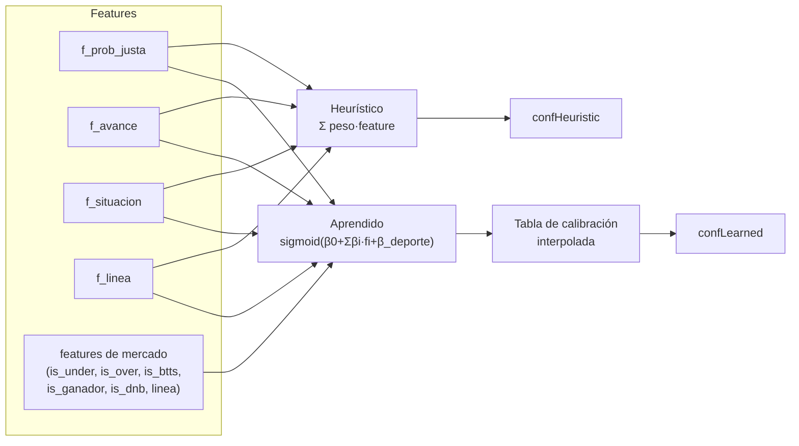

# Reporte 2 — Modelos (heurístico vs aprendido), entrenamiento y resultados por etapa

> Complementa [reporte-01-arquitectura-flujo.md](reporte-01-arquitectura-flujo.md). Aquí el foco es *cómo se calcula la confianza de un pick* y *cómo se validó cada cambio*, no el pipeline completo.

## 1. Dos modelos, un mismo punto de entrada

`src/model.js::score(features, sport)` siempre calcula el heurístico; calcula el aprendido salvo en `MODEL_MODE=heuristic`. Cuál de los dos **decide** depende del modo (ver reporte 1, §2.3). Ambos comparten las mismas features base — ninguno ve algo que el otro no pueda auditar.

## 2. Modelo heurístico

Suma ponderada fija, sin entrenamiento: `HEURISTIC_WEIGHTS` en `.env` (`f_prob_justa=0.4375, f_avance=0.375, f_situacion=0, f_linea=0.1875`). Es el fallback universal — si no hay `model.json`, o `MODEL_MODE=heuristic`, todo el sistema sigue operando con esto.

**Cambio clave: `f_situacion` a peso 0 (2026-08-09).** Medida su correlación con acertar sobre 1151 picks liquidados: **−0.119** (negativa) — restaba señal con el 20% del peso que tenía. Efecto con corte temporal (`MIN_CONF=0.70`, `MIN_EDGE=0.03`):

| Periodo | Con f_situacion | Sin f_situacion |
|---|---|---|
| TRAIN 07-17→08-05 | N=714, WR 74.5%, ROI +8.4% | N=346, WR 76.6%, ROI +10.0% |
| TEST 08-05→08-09 | N=174, WR 58.6%, ROI −9.3% | N=41, WR 75.6%, ROI +11.2% |

Consistente y **mayor fuera de muestra** — el motivo para quitarla, no solo el resultado en train. Costo: recorta emisión ~56%, pero de picks que en conjunto perdían.

## 3. Modelo aprendido

**Arquitectura:** `LogisticRegressionCV` (regularización elegida por CV interno, `scoring=neg_log_loss`) sobre las 4 features base + features de mercado + dummy por deporte, seguida de una capa de calibración. Entrenado por `scripts/train_weights.py`, servido en Node vía `model.json` (coeficientes + tabla de calibración interpolable) — Node nunca corre sklearn en producción.

### 3.1 Validación: walk-forward, no k-fold aleatorio
K bloques temporales iguales → K−1 folds, cada uno entrena en el pasado y valida en el bloque siguiente. Es deliberado: un k-fold aleatorio filtraría información del futuro (el mercado se mueve con el tiempo — ver [comparar-en-la-misma-ventana](../memory/comparar-en-la-misma-ventana.md)). Se reporta Brier y log-loss por fold y agregados out-of-sample, y se exige **mayoría de folds ganados**, no solo el promedio — un único fold puede hundir el agregado sin que el modelo sea malo en general.

### 3.2 Calibración: Platt, no isotónica (decisión revertida)
Se probaron ambas. Comparativa sobre n=17.904, walk-forward de 4 folds:

| Método | Brier | log-loss | peor fold | valores distintos | volumen >0.70 |
|---|---|---|---|---|---|
| Isotónica | 0.22756 | 0.64691 | 0.66289 | 30 de 200 | 12.1% |
| Platt (sigmoid) | 0.22889 | 0.64963 | mejor | continuo | 12.6% |

La isotónica gana por poco en Brier/log-loss agregado, pero es **una escalera de 30 peldaños** — 94.8% de lo que supera `MIN_CONF=0.70` caía en 2 peldaños indistinguibles (ver [calibracion-isotonica-colapso](../memory/calibracion-isotonica-colapso.md)). Con folds grandes gana por poco; en el fold de 630 muestras se descalabra (log-loss 0.7236). Decisión: Platt por defecto (`CAL_METHOD=sigmoid`), isotónica disponible pero no recomendada sin rederivar. El modelo sin calibrar ya gana 4/4 folds contra el heurístico en ambas métricas — la calibración ordena la lectura como probabilidad, no mejora la discriminación.

### 3.3 Features de mercado (2026-08-19) — el cambio que sí funcionó
El modelo era ciego a **qué mercado** era el pick, pese a que el mercado es la única variable que discrimina de verdad (Under línea≤3.5 ROI +9.8% IC[+3.1%,+16.4%] vs Over ROI −22.2% IC[−39.9%,−4.6%]). Medido sobre picks **emitidos** (la métrica que decide, no el dataset completo):

| Variante | Δ Brier | Folds que ganan |
|---|---|---|
| Base (5 features) | −0.0011 | 2/4 |
| + mercado + línea | **+0.0044** | **4/4** ← pasa la regla |
| Control: + ruido aleatorio | −0.0006 | 1/4 (no mejora, como debe) |

El control con ruido no mejora — confirma que la ganancia es información real, no capacidad extra del modelo absorbiendo cualquier feature.

### 3.4 Intento que no funcionó: cubrir más mercados (2026-08-22)
Se agregaron `is_handicap`, `hcp_line`, `is_ganador_alt`, `is_doble` para tapar el 15.1% de picks sin features de mercado. Medido sobre N_oos=549:

| Variante | Δ Brier | Folds |
|---|---|---|
| Actual (mercado base) | +0.0023 | 3/4 |
| + handicap | +0.0023 | 3/4 (delta 0) |
| + ganador_alt | +0.0026 | 3/4 (delta +0.0003) |
| + doble | +0.0009 | 2/4 (delta −0.0014) |
| + todo | +0.0013 | 3/4 (delta −0.0010) |
| Control: ruido | +0.0018 | 3/4 |

Los deltas de las candidatas son del tamaño del ruido, y sumarlas todas **empeora**. Revertido: "no se envía código que no se gana su sitio" (regla de trabajo del proyecto). Nota de fondo: la ventaja del mercado base también encogió de +0.0044 (4/4, primera medición) a +0.0023 (3/4, con 3 días más de datos) — comportamiento esperado de un resultado con sesgo de selección, no motivo de alarma por sí solo.

## 4. Fallback de features ausentes — el bug que ya costó una reconstrucción

Antes: feature ausente → `0.5` en silencio. Para las 4 features continuas es defendible ("neutro"); para un binario de mercado (`is_under`, `is_over`…) es un valor que el modelo **nunca vio entrenando** (0 o 1) — el mismo tipo de skew que costó reconstruir 2228 filas de `f_avance`. Ahora: binario ausente → `0`, con un aviso único en consola (no un log por cada pick). Ver `valorFeature()` en `src/model.js`.

## 5. Sello de versión del modelo

`conf_learned` se persiste siempre (incluso en `shadow`, donde no decide nada), pero cada reentrenamiento cambia su escala. Desde 2026-08-25, cada score lleva `modelVersion` = `<trained_at>-<hash7 del contenido>` — el hash detecta un `model.json` editado a mano que conserva su timestamp. Sin esto, agrupar análisis por `conf_learned` cruzando dos modelos mezclaba escalas sin avisar (pasó, en silencio, al cambiar de isotónica a Platt).

## 6. Estado por etapa — resumen cronológico

| Etapa | Qué cambió | Resultado medido | Fuente |
|---|---|---|---|
| Heurístico, pesos iniciales | `f_situacion` con 20% de peso | Correlación −0.119 con acertar | [por-que-no-entrena](../memory/por-que-no-entrena.md) |
| Heurístico, ajuste | `f_situacion` → peso 0 | ROI test +11.2% vs −9.3% | §2 arriba |
| Aprendido, primer intento | Kelly + modo `learned` en producción | Confianza inflada, stake multiplicado sobre ella | [model-adoption-incident](../memory/model-adoption-incident.md) |
| Aprendido, calibración | Isotónica → Platt | Discriminación igual, lectura como probabilidad ya no colapsa | §3.2 |
| Aprendido, features de mercado | +mercado/línea | 4/4 folds, Δ Brier +0.0044 | §3.3, [modelo-aprende-mercado](../memory/modelo-aprende-mercado.md) |
| Aprendido, cobertura de mercado | +handicap/ganador_alt/doble | Empeora o no aporta; revertido | §3.4 |
| Aprendido, grupo de control | Entrenar incluyendo `rejected_picks` | 3/4 folds, cerca de la barra sin cruzarla; 2 bugs de datos corregidos | [entrenamiento-con-grupo-control](../memory/entrenamiento-con-grupo-control.md) |
| Aprendido, partición de rechazados | Separar lo que el heurístico tira por `min_conf` | +5.56% vs −17.85% (n=5142) | [modelo-parte-los-rechazados](../memory/modelo-parte-los-rechazados.md) |

**Estado actual:** `MODEL_MODE=shadow` en producción. El aprendido pasa la regla de mayoría de folds en la comparación más reciente pero no ha cruzado la barra para operar en `learned` de forma sostenida — sigue en veto/auditoría, no como decisor.

## 7. Qué falta para el reporte 3 (si se decide continuar la serie)

Sizing/staking (Kelly vs plano vs escalonado por línea+apertura) y firewall como capa separada del modelo — ya cubierto parcialmente en el reporte 1 §2.4, pero la evolución completa de sizing amerita su propio reporte si se necesita ese nivel de detalle.
