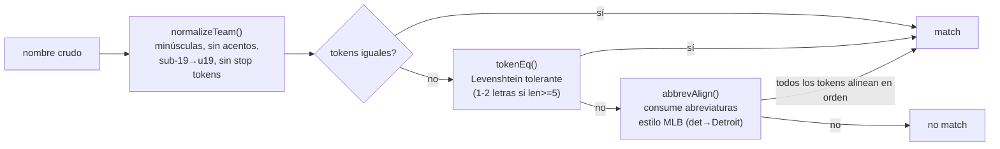

# Reporte 15 — Algoritmos y estructuras computacionales

> Catálogo de algoritmos no estadísticos: cómo están implementados y qué problema concreto resuelven. Complementa [reporte-14-metodos-estadisticos.md](reporte-14-metodos-estadisticos.md) (matemática/estadística) y el [glosario](glosario.md).

## 1. De-vig como algoritmo numérico

Ya cubierto estadísticamente en el reporte 14 §1; la parte algorítmica interesante es cómo se resuelven los métodos que no tienen forma cerrada:

- **`power`**: búsqueda binaria sobre `k` tal que `Σ p_i^k = 1`. Converge porque `f(k)` es estrictamente decreciente (200 iteraciones, tolerancia `1e-9`), y renormaliza el residuo al final para garantizar suma exacta 1.
- **`shin`**: bisección sobre `z ∈ [0,1)` para la función `g(z) = Σπ_i(z) − 1`, continua y decreciente. Caso especial cerrado para mercados de 2 resultados (`n=2` colapsa a additive).

Ambos son bisección clásica — elegida sobre Newton porque no hace falta la derivada y la función es monótona y acotada, así que la convergencia está garantizada sin análisis adicional.

## 2. Matching de eventos entre fuentes (`teamMatch.js`)

Problema: **el mismo partido llega con nombres de equipo distintos** desde playdoit y SofaScore (abreviaturas, acentos, idioma, sufijos de categoría). Es código compartido (no reescrito) entre `sharp.js` (playdoit↔The Odds API) y `sofaMatch.js` (playdoit↔SofaScore) — la nota en el propio archivo explica que ya pasó por un bug de abreviaturas tipo MLB y reinventarlo arriesgaría repetirlo (ver [sharp-coverage-diagnosis](../memory/sharp-coverage-diagnosis.md)).

Pipeline de normalización + matching, en orden:

- **`normalizeTeam`**: unifica notación de categorías juveniles (`sub 19` / `Sub-19` → `u19`) *antes* de tokenizar — necesario porque, como cadenas, "sub" y "u19" no comparten ningún carácter y Levenshtein no los acercaría. Bug real que motivó esto: la Liga Juvenil UEFA estaba en el barrido y aun así no matcheaba (2026-09-08).
- **`editDistance`** (Levenshtein clásico, programación dinámica O(m·n) con una sola fila `prev`/`cur`): tolera variantes ES/EN del mismo nombre (Zimbabue/Zimbabwe). Corte temprano: si `|len(a)-len(b)| > 2`, se descarta sin calcular (nunca podría estar dentro de tolerancia).
- **`tokenEq`**: exige token idéntico si es corto (<5 caracteres); si es largo, tolera 1 carácter de diferencia (≥5) o 2 (≥8) — evita falsos positivos entre tokens cortos que por azar están a distancia 1 (ej. "de" vs "el").
- **`abbrevAlign`/`abbrevConsume`**: back-tracking recursivo que alinea tokens abreviados (2-3 caracteres) contra uno o más tokens del nombre largo consumidos por prefijo o iniciales (`"det"→"Detroit"`, `"ny"→"New York"`). Exige que **todos** los tokens de ambos lados terminen alineados en orden — así "NY Yankees" no matchea "New York Mets" solo porque comparten una abreviatura.

## 3. Interpolación de la tabla de calibración (`interp()` en `model.js`)

Búsqueda binaria (O(log n)) sobre el eje `x` (ascendente) de la tabla de calibración, seguida de interpolación lineal entre los dos puntos vecinos; clamp a los extremos si el valor cae fuera del rango entrenado. Es la pieza que convierte el score crudo del modelo aprendido en una probabilidad calibrada sin necesitar sklearn en producción — `model.json` solo trae la tabla (`x`, `y`), no el objeto de calibración de Python.

## 4. Dedupe

Dos mecanismos distintos, cada uno resolviendo un problema distinto:

- **Dedupe de picks nuevos** (`db.isDuplicatePick`): antes de registrar un pick, comprueba si ya existe un pick **activo** para el mismo evento, o un pick con la misma selección+mercado para ese evento — evita duplicar exposición de stake sobre el mismo partido.
- **Dedupe de alertas de valor** (`value_alerts`, ver [alertas-valor.md](alertas-valor.md)): una fila por `pick_id`, marcada **antes** de enviar el mensaje a Telegram (no después) — ante un fallo a mitad de envío, el diseño prefiere perder una alerta a repetirla en el chat.

## 5. Candado de instancia única (`singleInstance.js`)

Lockfile con PID + timestamp. El detalle no trivial: `process.kill(pid, 0)` para comprobar si un proceso sigue vivo lanza `ESRCH` si no existe, pero **`EPERM` si existe y pertenece a otro usuario** — y ese es justo el escenario real de este proyecto (dos cuentas de Windows en la misma máquina, ver [two-windows-accounts](../memory/two-windows-accounts.md)). Por eso `EPERM` se trata como "vivo", no como error.

El lock es *best-effort* de forma deliberada: un archivo corrupto o un PID muerto sin limpiar se reclama y el arranque continúa — nunca debe bloquear un arranque legítimo tras un crash. Se libera en `exit`, `SIGINT`, `SIGTERM` y `SIGHUP`, y solo se borra si el PID en el archivo sigue siendo el propio (para no desproteger un lock que otra instancia ya reclamó).

## 6. Rate limiting (`ratelimit.js`)

Ventana deslizante simple: un array de timestamps, se filtra por antigüedad (`< 60000 ms`) en cada `acquire()`, y si ya hay `MAX_REQ_PER_MIN` marcas vigentes, espera en incrementos de 1s hasta que una expire. No usa un contador con reset periódico (token bucket clásico) — la ventana deslizante evita el efecto "ráfaga al inicio del minuto" que un contador con reset fijo permitiría.

## 7. Poda de la base de datos (`pruneSnapshots`)

Recorre `snapshots` en ventanas de `rowid` (tamaño `scan`, por defecto 50.000) en vez de un `DELETE` global, con un tope de tiempo (`maxMs`) por invocación — pensado para no bloquear la BD con una operación larga mientras el bot sigue escribiendo. El cursor avanza al `MAX(rowid)` **existente** dentro de la ventana, no sumando `scan` a ciegas, porque los `rowid` tienen huecos tras cada borrado previo y sumar a ciegas re-escanearía rangos ya vacíos.

Dos cortes de retención distintos, no uno: eventos **sin** pick usan `cutoff` (más corto), eventos **con** pick usan `pickedCutoff` (más largo, 60 días por defecto) — y los eventos con un `rejected_pick` aún sin liquidar quedan protegidos sin límite, porque siguen en juego, no son historial cerrado todavía.

**Limitación conocida** (documentada en el propio código): `pruneSnapshots` solo actúa sobre la tabla `snapshots`. El resto de tablas de crecimiento (`stat_snapshots`, `sofa_corner_snapshots`, `sofa_forecast_snapshots`) no tienen poda todavía — consistente con el hallazgo de memoria [db-growth-unsustainable](../memory/db-growth-unsustainable.md).

## 8. Resumen: algoritmo → problema que resuelve

| Algoritmo | Problema |
|---|---|
| Bisección (power, shin) | Resolver una ecuación sin forma cerrada, con garantía de convergencia |
| Levenshtein + tokenización | Emparejar el mismo evento con nombres distintos entre fuentes |
| Back-tracking de abreviaturas | Emparejar nombres tipo "NY" ↔ "New York" sin falsos positivos |
| Búsqueda binaria + interpolación lineal | Servir una calibración entrenada en Python sin runtime de Python |
| Marcado antes de enviar | Evitar reenvíos duplicados ante fallos parciales |
| Lockfile con verificación EPERM-aware | Instancia única entre cuentas de Windows distintas |
| Ventana deslizante de timestamps | Limitar tasa de peticiones sin efecto ráfaga |
| Poda por ventana de rowid con cursor adaptativo | Retención de BD sin bloquear escritura concurrente |
