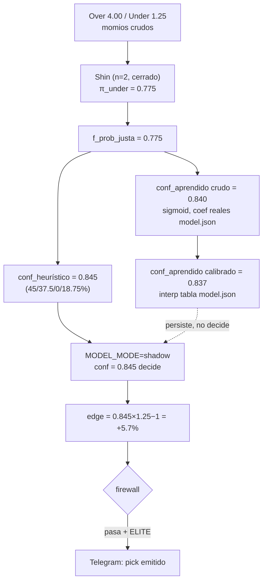

# Reporte 16 — Ejemplo end-to-end: de un momio a un pick, pasando por Shin

> Traza un pick concreto, con números, por cada etapa del pipeline descrito en [reporte-01](reporte-01-arquitectura-flujo.md). Los coeficientes del modelo aprendido son los **reales** de `model.json` (entrenado 2026-09-06); las features de partido (avance, situación, línea) son **ilustrativas** para que el ejemplo cierre — se marca explícitamente dónde.

## 0. El pick

Fútbol, minuto 75, marcador 1-0. Mercado "Total 2.5", selección **"Menos de 2.5"** (Under). Momios en vivo, ambos lados activos:

| Selección | Momio decimal |
|---|---|
| Más de 2.5 (Over) | 4.00 |
| Menos de 2.5 (Under) | **1.25** ← el pick |

## 1. De-vig con Shin (`src/devig.js`, invocado desde `normalize.js`)

Probabilidades implícitas crudas: `p = 1/odd`.

```
p_over  = 1/4.00 = 0.2500
p_under = 1/1.25 = 0.8000
Σp      = 1.0500   (5% de margen de la casa)
```

Con `n=2` selecciones, Shin tiene solución cerrada — colapsa al método aditivo (ver [reporte-15 §1](reporte-15-algoritmos.md#1-de-vig-como-algoritmo-numérico)):

```
ajuste = (Σp − 1) / 2 = 0.0250
π_over  = 0.2500 − 0.0250 = 0.2250
π_under = 0.8000 − 0.0250 = 0.7750
Σπ = 1.0000  ✓
```

**`f_prob_justa` (Under) = 0.7750.** Esto es `row.fairProb` en `confidence.js:scoreRow` — la probabilidad de que el partido termine con menos de 2.5 goles, con el margen de la casa ya removido, calculada sobre *este mismo mercado en este instante* (no contra otra casa).

Nota importante de diseño: como esta probabilidad sale del mismo par de momios que se está evaluando, `f_prob_justa` por sí sola **nunca genera edge positivo** contra su propio momio — solo remueve el sesgo del margen. El edge real, si existe, viene de que las features de contexto del partido (abajo) empujen la confianza *por encima* de lo que el mercado ya tiene puesto en el precio.

## 2. Features de contexto (ilustrativas — no hay snapshot real detrás de este ejemplo)

| Feature | Valor | De dónde sale |
|---|---|---|
| `f_avance` | 0.95 | Función del minuto transcurrido (75/90) — a más tiempo sin cruzar la línea, más certeza de Under |
| `f_situacion` | 0.90 | `situationFactor()` — evalúa si el estado del partido favorece la selección |
| `f_linea` | 0.80 | `lineTrend()` — la línea de mercado se ha movido a favor de Under en los últimos snapshots |
| `is_under` | 1 | `marketFeatures()` — indicador binario de mercado (ver [reporte-02 §3.3](reporte-02-modelos-entrenamiento.md#33-features-de-mercado-2026-08-19--el-cambio-que-sí-funcionó)) |

## 3. Score heurístico (`model.js::heuristicConf`, pesos reales de `.env`/default)

```
conf_heuristico = 0.4375·f_prob_justa + 0.375·f_avance + 0·f_situacion + 0.1875·f_linea
                = 0.4375×0.7750 + 0.375×0.95 + 0×0.90 + 0.1875×0.80
                = 0.3391 + 0.3563 + 0 + 0.1500
                = 0.8453
```

`f_situacion` pesa 0 desde 2026-08-09 (correlación negativa con acertar — ver [reporte-02 §2](reporte-02-modelos-entrenamiento.md#2-modelo-heurístico)), por eso no aporta pese a tener un valor alto.

## 4. Score aprendido (`model.js::learnedConf`, coeficientes REALES de `model.json`)

```
z = intercept + Σ(coef_i · feature_i) + sport_coef[Fútbol]

  = -2.5237
    + 3.1431×0.7750   (f_prob_justa)   = +2.4359
    + 0.7622×0.95     (f_avance)       = +0.7241
    + 0.6643×0.90     (f_situacion)    = +0.5979
    + 0.3438×1        (is_under)       = +0.3438
    + 0.0819          (sport_coef Fútbol)
  ------------------------------------------------
  z ≈ 1.6599
```

Nótese que aquí `f_situacion` **sí** pesa (coef 0.664) — el modelo aprendido no heredó la decisión de excluirla; la aprendió (o no) por su cuenta a partir de los datos.

```
raw = sigmoid(z) = 1 / (1 + e^-1.6599) ≈ 0.8403
```

Ese crudo pasa por la tabla de calibración real de `model.json` (interpolación lineal, [reporte-15 §3](reporte-15-algoritmos.md#3-interpolación-de-la-tabla-de-calibración-interp-en-modeljs)):

```
conf_learned = interp(0.8403) ≈ 0.8373
```

## 5. Qué confianza decide (`MODEL_MODE`)

```
MODEL_MODE=heuristic → conf = 0.8453  (heurístico)
MODEL_MODE=shadow    → conf = 0.8453  (heurístico decide; 0.8373 se persiste sin decidir) ← producción
MODEL_MODE=learned   → conf = 0.8373  (aprendido decide)
```

Ambos números son parecidos en este ejemplo (0.845 vs 0.837) — no siempre es así; la brecha entre ambos es justamente lo que el modo `shadow` existe para vigilar antes de confiar en el aprendido (ver [model-adoption-incident](../memory/model-adoption-incident.md)).

## 6. Edge y decisión de emitir

Con `conf = 0.8453` (modo shadow, producción) y el momio ofrecido de 1.25:

```
edge = conf × oddDecimal − 1 = 0.8453 × 1.25 − 1 = 0.0566   (+5.7%)
```

Pasa `MIN_EDGE` (0.03 en el ejemplo de referencia del reporte 1) y `MIN_CONF` (0.70 típico). Ahora el **firewall** (`src/firewall.js`):

- No es Over → R1 no aplica.
- `f_avance` (progress, 0.95) ≥ 0.40 → R2 no bloquea.
- Under con línea 2.5 ≤ 3.5 → R7 no bloquea (esa es justo la zona donde el proyecto midió edge real, [reporte-01 §2.4](reporte-01-arquitectura-flujo.md#24-firewall-firewalljs)).
- `isElite`: Under ✓, avance 0.95 ≥ 0.75 ✓, `f_linea` 0.80 ≥ 0.55 ✓ → **cae en tier ELITE**.

**Resultado: el pick se registra (`logPicks`), se formatea y se envía a Telegram, marcado como ELITE.**

## 7. Resumen visual



## 8. Qué demuestra este ejemplo

1. Shin no "crea" el edge — solo limpia el margen de la casa antes de que el resto del pipeline evalúe si hay razón (avance, situación, línea) para creer que la probabilidad real es distinta a lo que el margen ya limpio sugiere.
2. Con `n=2` (la mayoría de los mercados de este proyecto: Over/Under, dos resultados), Shin tiene solución cerrada — no hace falta la bisección genérica, solo en mercados de 3+ resultados (ej. 1x2).
3. El heurístico y el aprendido parten de la **misma** `f_prob_justa`, pero el aprendido sí usa `f_situacion` con coeficiente propio — pueden divergir, y el modo `shadow` es la salvaguarda mientras esa divergencia no se audite.
