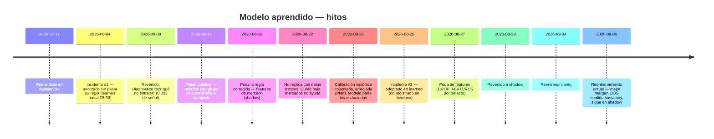

# Reporte 17 — Desempeño del modelo aprendido (`learned`): historia completa

> Reconstrucción exhaustiva desde el primer entrenamiento hasta hoy (2026-09-13). Fuentes: memoria persistida del proyecto, comentarios versionados en `scripts/train_weights.py`/`src/model.js`, `git log`, y **consultas directas a `snapshots.db`** para reconstruir el tramo 2026-08-25→hoy, que no tiene commits ni memoria (todo el trabajo de ese periodo vive sin commitear en el working tree — ver `git status`). Todo dato de BD en este reporte se marca como tal.
>
> **Hallazgo principal de esta auditoría**: hubo un **segundo incidente de adopción** (26→29 de agosto) que ningún archivo de memoria registra. Se documenta en detalle en §7.

## 1. Línea de tiempo



## 2. Fase 0 — Nacimiento e incidente #1 (2026-07-17 → 2026-08-09)

`model.json` entrenado el 2026-08-05 (calibración isotónica) se adoptó con `adopted:true` **pese a fallar su propia regla**: `oos_metrics.calibrated` (Brier 0.1902, log-loss 0.5813) era peor que el heurístico (0.1897 / 0.5668), 2/4 folds Brier y **0/4 log-loss**. Se adoptó con una versión anterior de la regla, más laxa.

Corrió en `MODEL_MODE=learned` del **08-04 al 08-08**:

| Métrica | Antes/después | Durante el incidente |
|---|---|---|
| Confianza media | ~65% (implícito) | **~76%** |
| Acierto real | — | **~65%** (11pp por debajo de la conf reportada) |
| Stake medio | ~1.0u | **~3.4u** (`computeStake` dimensiona con `conf`) |
| Drawdown máximo | — | **61.8u** |

Revertido el 08-09. Defensa estructural añadida: `adopted:false` + `disabled_reason` en `model.json` hace que `learnedConf()` devuelva `null` incluso si alguien repone `MODEL_MODE=learned` — el interruptor de emergencia ya no depende de una sola variable de entorno.

**Dos reentrenamientos consecutivos posteriores tampoco superaron al heurístico** (el del 08-09, N=1278: Brier +0.0005, log-loss +0.0000, 2/4 folds) — con ese tamaño de muestra ya es evidencia de que las features no rendían más de lo que el heurístico ya extraía, no mala suerte.

Fuente: [model-adoption-incident](../memory/model-adoption-incident.md).

## 3. Fase 1 — Diagnóstico: "por qué no entrena" (2026-08-09)

Sobre N=1816 liquidados (sin `global_draw`), tres causas medidas:

1. **Casi no hay señal.** Brier de un predictor constante (tasa base 69.9%) = 0.2104; heurístico 0.2075; el mejor candidato 0.2073. Todo lo aprendible con esas features valía **0.003 de Brier**.
2. **La mezcla resta señal.** `f_situacion` correlación −0.119 con acertar, pesando 20% en el heurístico. Quitarla mejoraba fuera de muestra: 0.2362 → 0.2336 → 0.2301 (solo `f_prob_justa`).
3. **El mapa no es estacionario — causa raíz.** El lift sobre el precio pasó de +8.9pp (train) a +1.8pp (test): 80% de caída en 3 semanas.

**CLV descartado como objetivo**: parecía prometedor (corr 0.567) pero era fuga de etiqueta — el "cierre" se toma 31 min antes de liquidar, con el partido casi resuelto.

Actualizado el 08-19: el punto 1 resultó demasiado fuerte — sí había señal, en una dimensión que el modelo no veía (el mercado). Ver Fase 3.

Fuente: [por-que-no-entrena](../memory/por-que-no-entrena.md).

## 4. Fase 2 — Falso positivo con el grupo de control (2026-08-16)

Primer entrenamiento que incluyó `rejected_picks`. Pasó la regla de adopción **con margen aparente** (Brier +0.0070, log-loss +0.0136, 4/4 folds) y se marcó `adopted:true`. Era un artefacto: los picks reales eran solo el 5.0% del pool de evaluación, así que el agregado medía "distinguir rechazado típico de pick típico" — trivial, no vale dinero. Sobre las 345 filas de picks reales, el mismo modelo daba **1/4 folds**, Brier **−0.0027**.

**Arreglo estructural** (commit `3de2100`): la regla de adopción ahora exige mejora y mayoría de folds **también sobre `origin='picks'`**, con `MIN_PICKS_OOS=300`. Se probó excluir sub-poblaciones ruidosas del grupo de control (`guardas5`, `mercado_bloqueado`, solo `min_conf`) — ninguna variante pasó, y un control negativo (quitar 9% al azar) dio resultado parecido, cerrando la hipótesis de que el problema eran esas filas.

Fuente: [entrenamiento-con-grupo-control](../memory/entrenamiento-con-grupo-control.md).

## 5. Fase 3 — Primer modelo que pasa la regla corregida (2026-08-19)

Commit `cef3c39`. Faltaba que el modelo supiera **de qué mercado** era el pick — el edge de mercado (Under≤3.5 vs Over) ya estaba cableado a mano en el firewall pero era invisible para el clasificador. Se añadieron `is_under/is_over/is_btts/is_ganador/is_dnb/linea`.

Sobre picks emitidos (N=439):

| Variante | Δ Brier | Folds |
|---|---|---|
| Base (5 features) | −0.0010 | 2/4 |
| **+ mercado + línea** | **+0.0044** | **4/4** |
| Control: ruido aleatorio | −0.0006 | 1/4 |

Bootstrap: P(mejora>0) = 95.4% Brier. Los coeficientes coincidieron con hallazgos independientes (`is_over` −0.520 vs ROI medido −22.2%). **Se adoptó, pero en `MODEL_MODE=shadow`** — el IC95% rozaba cero y la hipótesis salió del mismo dataset que la produjo.

**El veto se probó y se apagó** (commit `88e7dce`): una puerta que solo podía *quitar* picks (`conf_heuristic` Y `conf_learned` ambos sobre umbral). Con walk-forward limpio, el segmento que el veto habría bloqueado era **rentable** fuera de muestra (+1.0u a +29.5u dejados de emitir con umbral 0.70) — el −23.5u que sugería la medición in-sample era sobreajuste, porque el modelo había visto esos mismos picks al entrenar. `MODEL_VETO=0`, código vivo pero inerte.

Fuente: [modelo-aprende-mercado](../memory/modelo-aprende-mercado.md).

## 6. Fase 4 — No replica con datos frescos (2026-08-22)

Tres días en shadow, 131 picks liquidados: el +0.0044 **no se reprodujo** (−0.0055 agregado). Bootstrap: P(modelo mejor)=1.3%. Se descartaron calibración y train/serve skew como causa — el daño se concentró en 23 picks **sin ninguna feature de mercado** (hándicaps sobre todo), una bolsa que pasó del 6.5% (entrenamiento) al 15.1% (esta ventana) y rindió un WR insostenible de 91.3%.

Se probó cubrir esa bolsa (`is_handicap`, `hcp_line`, `is_ganador_alt`, `is_doble`, commit `5aa8766`) — **no ayudó**: los deltas de las candidatas quedaron del tamaño del ruido de un control aleatorio (que se movió −0.0004→−0.0015 entre dos corridas). Revertido.

**Dato de fondo más importante de esta fase**: con 3 días más de datos, la ventaja del propio mercado base bajó de +0.0044 (4/4 folds) a **+0.0023 (3/4)** — encogiendo justo como se espera de un resultado con sesgo de selección.

Fuente: [modelo-aprende-mercado](../memory/modelo-aprende-mercado.md) (sección "primer contraste con datos frescos").

## 7. Fase 5 — Calibración colapsada y primera evidencia sólida (2026-08-25)

**Isotónica colapsada**: `conf_learned` salía clavado en 0.70 para el 94.8% de los picks porque la tabla isotónica solo tenía 30 valores distintos en 200 puntos, con un hueco entre 0.6678 y 0.7025 — justo donde cae `MIN_CONF`. Causa raíz: `ISOTONIC_MIN` se fijó en 2000 el 08-09 con n=1576; el dataset creció a 17.904 y cruzó el umbral sin que nadie lo decidiera. Medido: calibrar **hace daño** (crudo Brier 0.2236 < isotónica 0.2276 < Platt 0.2289 — aunque Platt gana por continuidad, ver [reporte-14 §6](reporte-14-metodos-estadisticos.md#6-calibración-de-probabilidades-isotónica-vs-platt)). `CAL_METHOD=sigmoid` pasó a ser default.

**Primera evidencia sólida de valor real**: agrupando `rejected_picks` con `reject_rule='min_conf'` (n=5.142, liquidados desde 08-20) por `conf_learned` calibrado:

```
calibrado ≥ 0.5053 → n=2.418, ROI +5.56%, IC95% [1.73%, 9.36%], P(ROI>0)=99.9%
calibrado < 0.5053 → n=2.724, ROI −17.85%
```

El modelo **sí** separa dentro de una bolsa que el heurístico trata como uniformemente descartable. Observacional, no experimento — pendiente de replicar antes de tocar `MIN_CONF`.

Fuentes: [calibracion-isotonica-colapso](../memory/calibracion-isotonica-colapso.md), [modelo-parte-los-rechazados](../memory/modelo-parte-los-rechazados.md).

## 8. Fase 6 — El incidente no documentado (2026-08-26 → 08-29)

**Esto no está en ningún archivo de memoria.** Reconstruido consultando `picks.model_mode`/`model_version` directamente en `snapshots.db`, porque tampoco hay commits en este rango (todo el trabajo posterior al 08-24 vive sin commitear en el working tree).

```
model_mode  model_version                  n     desde                hasta
learned     20260825T181821Z-a738ba9       96    2026-08-26 17:27     2026-08-27 13:44
learned     20260827T134316Z-ec891d3       119   2026-08-27 14:09     2026-08-28 17:05
learned     20260828T170521Z-085ff8b       515   2026-08-28 17:07     2026-08-29 19:13
shadow      20260828T170521Z-085ff8b       205   2026-08-29 19:35     2026-09-04 14:01
```

**El modelo decidió en producción durante ~3 días, 730 picks liquidados**, con tres reentrenamientos en caliente en medio (algo que el propio código de `model.js` anticipa — el sello de versión existe justo para poder auditar esto después, ver [reporte-02 §5](reporte-02-modelos-entrenamiento.md#5-sello-de-versión-del-modelo)).

**Medido sobre esos 730 picks liquidados (consulta directa a `snapshots.db`, excluye `global_draw`)**:

| | Periodo LEARNED (08-26→08-29) | Periodo SHADOW inmediato siguiente (08-29→09-04) |
|---|---|---|
| N liquidados | 729 | 411 |
| WR | 69.7% | 72.7% |
| Confianza media (`conf`) | 0.727 | — |
| Confianza heurística media | 0.626 | — |
| **Brecha conf vs heurístico** | **+10.1pp** | 0 (shadow no decide) |
| Stake medio | **1.53u** | **0.87u** |
| Stake total apostado | 1115.4u | 358.2u |
| P/L | +17.58u | +37.42u |
| **ROI sobre lo apostado** | **+1.58%** | **+10.45%** |
| Drawdown máximo | **25.07u** | 7.59u |

**El patrón es el mismo que el incidente #1, en miniatura**: confianza inflada ~10pp por encima del heurístico → `computeStake` dimensiona más grande (76% más stake por pick) → drawdown máximo 3.3× mayor → y a cambio, **peor ROI, no mejor** (1.58% vs el 10.45% que rindió el heurístico solo, apostando un tercio del capital, en el periodo inmediatamente posterior). No hay evidencia en el repositorio de qué disparó la reversión a `shadow` el 08-29 (sin commit, sin memoria) — pero los números explican por qué revertirla fue lo correcto.

**Nota de honestidad estadística**: comparar el tramo `learned` contra el tramo `shadow` que le sigue no es un experimento controlado — son regímenes de mercado consecutivos, no la misma ventana ([reporte-14, regla de comparar-en-la-misma-ventana](reporte-14-metodos-estadisticos.md)). El ROI +10.45% del tramo shadow también podría no sostenerse. Lo que **sí** es comparable dentro del propio tramo `learned` es la brecha conf−conf_heurístico y su efecto mecánico en el stake, que es exactamente la causa demostrada del incidente #1.

## 9. Fase 6b — Poda de features (2026-08-27, en medio del incidente)

Documentado únicamente en un comentario de `scripts/train_weights.py` (líneas 81-98), no en memoria. Medido con bootstrap por clúster de evento (B=600 resamples), IC95% de cuatro features cruzando cero:

```
f_apertura  [-0.0417, +0.1320]
f_linea     [-0.0997, +0.0532]
linea       [-0.0204, +0.1191]
is_dnb      [-0.0171, +0.0535]
```

Podarlas (`DROP_FEATURES` default) deja el modelo con **7 features en vez de 11**, con Brier prácticamente idéntico (+0.0029 podado vs +0.0030 completo). Motivo adicional, no solo estadístico: `f_apertura` y `f_linea` son las dos únicas features que leen histórico de snapshots — la única superficie con riesgo de fuga temporal. La poda es el default fijado en código (no una opción), "para que un reentrenamiento futuro no lo revierta sin que nadie lo decida".

**Esto explica por qué el `model.json` actual tiene 7 features** (`f_prob_justa, f_avance, f_situacion, is_under, is_over, is_btts, is_ganador`) en vez de las 9-11 que describían las fases 3-4 arriba.

## 10. Fase 7 — Reentrenamientos posteriores y estado actual (2026-09-04 → hoy)

Dos reentrenamientos más, ambos ya con `MODEL_MODE=shadow` (no vuelto a poner en `learned` desde el 08-29):

- **2026-09-04** (`20260828T170521Z-907bd87` — mismo `trained_at` base, hash de contenido distinto): sin datos de `oos_metrics` disponibles en este working tree (fue reemplazado por el siguiente).
- **2026-09-06** (`20260906T213144Z-7993ccb`) — **el modelo vigente hoy**, `adopted:true`, 29.345 muestras de entrenamiento.

**Validación interna de este modelo (de su propio `model.json`, la medición más robusta registrada hasta hoy)**:

| | Agregado (n=23.476) | Solo picks emitidos (n=1.745, 7.43% del pool) |
|---|---|---|
| Brier heurístico | 0.2378 | 0.2052 |
| Brier calibrado | 0.2276 | 0.2013 |
| Δ Brier | +0.0107 | **+0.0039** |
| Δ log-loss | — | **+0.0087** |
| Folds ganados | 4/4 | **4/4** |
| `passed` | — | **true** |

`n_picks_only=1.745` es **4× más grande** que el N=439 que superó la primera regla en la Fase 3, y el margen (Δ Brier +0.0039) es consistente con el +0.0023-0.0029 al que había convergido la medición tras corregirse por sesgo de selección en fases anteriores — no es un número inflado nuevo, es la misma señal midiéndose con más datos y sosteniéndose.

**Desempeño real del sistema desde que este modelo está en shadow (2026-09-06 → hoy, consulta directa a BD, decide el heurístico)**:

```
n liquidados = 261
WR = 67.4%
P/L = −1.16u
Drawdown máximo = 19.01u
conf (heurístico, decide) media = 0.7168
conf_learned (sombra, no decide) media = 0.6866
```

**Lectura honesta**: el sistema real (heurístico) está prácticamente plano en este tramo — no es una medición del modelo aprendido (que no decide), es el contexto de mercado en el que el modelo actual lleva una semana en sombra sin haberse podido contrastar con dinero real. No hay, en este working tree, una réplica de la partición de `rejected_picks` (Fase 5, [modelo-parte-los-rechazados](../memory/modelo-parte-los-rechazados.md)) hecha específicamente con el `model_version` del 09-06 — es el primer punto pendiente de la sección 11.

## 11. Qué queda abierto (para no fingir que la historia está cerrada)

1. **Por qué se revirtió el 08-29** no está documentado en ningún lado (ni commit, ni memoria, ni comentario de código) — solo se puede inferir de los números, que sí lo justifican.
2. **El modelo del 09-06 nunca se puso en `learned`** pese a tener el mejor margen OOS medido hasta hoy — no hay registro de una decisión explícita de mantenerlo en shadow más tiempo, solo la ausencia de un cambio.
3. **La partición de rechazados (Fase 5) no se ha repetido** con el modelo actual — es la verificación pendiente más directa antes de considerar tocar `MIN_CONF` o el modo del modelo, y el propio hallazgo de origen lo pedía explícitamente ("replicar con el modelo nuevo... antes de mover MIN_CONF").
4. **Nada de lo ocurrido desde 2026-08-25 está commiteado.** `model.js`, `confidence.js`, `firewall.js`, `train_weights.py` y `model.json` aparecen como cambios sin confirmar en `git status` — si la máquina se reinstala o el working tree se pierde, toda esta segunda mitad de la historia (incluida la defensa aprendida del incidente #2) desaparece sin dejar rastro más que este reporte.

## 12. Resumen para quien solo lea esta sección

- El modelo aprendido tuvo **dos** incidentes de adopción prematura en `learned` (04-08 ago y 26-29 ago), ambos con el mismo mecanismo: confianza inflada → stake más grande vía `computeStake` → peor resultado ajustado a riesgo, no mejor.
- Cada incidente fue seguido de una reversión a `shadow` y una mejora estructural: sello de `adopted:false` tras el #1; ningún hardening estructural nuevo tras el #2 más allá de la poda de features (que ya estaba en marcha antes del incidente, no fue causada por él).
- El modelo vigente hoy (09-06) tiene la validación interna **más sólida y con más datos** de toda su historia, pero sigue en `shadow` — la disciplina de "shadow/veto, nunca decisor único" ([contexto-ia.md](contexto-ia.md)) se está respetando en la práctica, no solo en el papel.
- La brecha entre lo que dice la memoria persistida (se detiene en 08-25) y lo que de verdad pasó (hasta hoy, reconstruido de la BD) es de **casi tres semanas** de trabajo activo — este reporte es, por ahora, el único lugar donde esa brecha queda cerrada.
