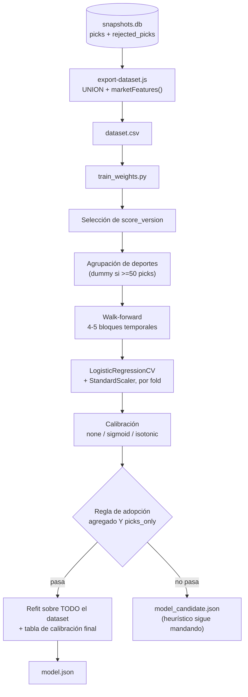

# Reporte 18 — Arquitectura del pipeline de entrenamiento

> Va a fondo en **cómo** se entrena el modelo aprendido: `scripts/export-dataset.js` + `scripts/train_weights.py`, línea por línea de lo que importa. Complementa [reporte-02](reporte-02-modelos-entrenamiento.md) (qué se probó y qué resultó) y [reporte-17](reporte-17-desempeno-modelo-learned.md) (historia y desempeño). Aquí el foco es la **maquinaria**: por qué cada pieza está construida así.

## 1. Vista general



## 2. Construcción del dataset (`export-dataset.js`)

### 2.1 Unión de dos poblaciones con un propósito específico

El dataset es una `UNION ALL` de `picks` (lo que el sistema emitió) y `rejected_picks` (el grupo de control — lo que el firewall/`MIN_CONF`/`MIN_EDGE` bloquearon). Añadido el 2026-08-11 tras diagnosticar por qué el modelo no aprendía nada ([reporte-02 §por qué no entrena](reporte-02-modelos-entrenamiento.md), memoria [por-que-no-entrena](../memory/por-que-no-entrena.md)): entrenar solo con picks emitidos es **restricción de rango** — comprime el 80% de las confianzas observadas en 9 puntos porcentuales y nunca le muestra al clasificador un negativo claro, porque todo lo que pasó ya estaba pre-filtrado para parecer bueno.

Medido en su momento:

| Población | N | WR | Rango `f_prob_justa` |
|---|---|---|---|
| `picks` | 1.932 | 69.8% | [0.228, 0.921] |
| `rejected` | 2.036 | 47.6% | [0.070, 0.713] — cubre zona que `picks` nunca vio |
| Combinado | 3.968 | 58.4% | — |

### 2.2 La columna `origin` — no es cosmética

Cada fila lleva `origin='picks'` u `origin='rejected'`. No es solo trazabilidad: es la columna que le permite a `train_weights.py` evaluar la regla de adopción **sobre la población que recibe dinero real**, por separado del agregado. Su ausencia costó una adopción errónea el 2026-08-16 (ver §5.2) — un modelo que "mejoraba" +0.0070 de Brier en el agregado porque el 95% del pool eran rechazados, y el clasificador solo estaba aprendiendo a distinguir "rechazado típico" de "pick típico" (dos poblaciones con `f_prob_justa` y mezcla de mercados distinta), algo trivial que no vale dinero.

### 2.3 Protección contra fuga temporal en la propia feature de avance

`f_avance` en el CSV se llena desde `f_avance_model` (el valor **servido** en producción, `1 - progress` para ciertos Over), no desde `progress` crudo. Exportar el crudo (como se hacía hasta 2026-08-09) era un train/serve skew silencioso: para cada "Más de X" con la línea aún sin alcanzar, entrenamiento veía una cosa y producción servía otra. Afectó a 368 de 2228 picks históricos, reparado con `scripts/backfill-avance-model.js`.

### 2.4 Exclusión explícita de features fabricadas

`WHERE COALESCE(score_version, 1) > 0` descarta las 224 filas que `globalDrawScanner.ts` insertó con constantes hardcodeadas antes del arreglo del 08-09 (ver [reporte-01](reporte-01-arquitectura-flujo.md), memoria [global-draw-fabricated-features](../memory/global-draw-fabricated-features.md)). El comentario del propio script advierte que hoy esas filas ya caen solas por `f_apertura IS NULL`, pero llama a esto "un accidente" — un backfill futuro de `f_apertura` las readmitiría en silencio, exactamente lo que ya pasó una vez con `f_avance_model`. El filtro explícito existe para no depender de ese accidente.

### 2.5 Fuente única de las features de mercado

`marketFeatures()` se importa de `src/model.js` — la misma función que corre en producción. Python nunca recalcula esas columnas, solo las lee del CSV ya calculadas. Es la misma disciplina de "una sola fuente de verdad" descrita en el [reporte-15](reporte-15-algoritmos.md) para evitar divergencias entre entrenamiento y servicio.

## 3. Selección de versión de features (`score_version`)

`f_linea` cambió de escala entre v1 (saturada en 1.0 para el 82% de los picks — feature muerta) y v2 (reescalada). Mezclarlas sin distinguir sería entrenar sobre dos variables distintas bajo el mismo nombre. Por defecto, `train_weights.py` usa **solo la versión más reciente que alcance `MIN_SAMPLES` (80)**; `SCORE_VERSION=all` mezcla todas añadiendo la versión como dummy (para cuando el bloque nuevo aún es chico); `SCORE_VERSION=<n>` fuerza una versión concreta.

## 4. Agrupación de deportes

Cada deporte con ≥50 picks (`SPORT_MIN`) recibe su propia dummy; el resto se agrupa en `otros`. Evita que un deporte con 6 observaciones le imponga un coeficiente de intercepto sport-específico con varianza absurda — el mismo principio que exige `MIN_PICKS_OOS` para la regla de adopción, aplicado a nivel de feature.

## 5. Ajuste del modelo por fold

### 5.1 Por qué `LogisticRegressionCV` y no `LogisticRegression()` a secas

Diagnóstico del 2026-07-28 (`scripts/diag_colinealidad.py`, n=374): el `C=1.0` por defecto de sklearn resultó mucho menos regularizado que el óptimo real (entre 0.001 y 0.19 según CV interna). Además, sin estandarizar, la penalización L2 castiga a las features de escala pequeña por su escala, no por su utilidad — escalar sin retunear `C` **empeoraba** (Brier 0.1853→0.1867); escalar y retunear **mejoraba** (→0.1845). De ahí el pipeline: `StandardScaler` + `LogisticRegressionCV(Cs=np.logspace(-3,2,12), cv=4, scoring='neg_log_loss')`, reajustado **dentro de cada fold** (el escalador nunca ve datos de validación).

### 5.2 Walk-forward con protección explícita contra folds degenerados

`k_blocks = 5 si n≥600, si no 4` → bloques temporales iguales vía `np.linspace`. Cada fold entrena en el pasado y valida en el bloque siguiente (nunca al revés — ver [reporte-14 §5](reporte-14-metodos-estadisticos.md#5-walk-forward-validación-temporal)). Un fold se **omite** si el train o el test tienen una sola clase, o si la clase minoritaria del train tiene menos de 4 filas — evitar entrenar o evaluar sobre algo que no puede dar una métrica con sentido, en vez de dejar que produzca un número engañoso.

Dentro de cada fold de test se calculan **dos** juegos de métricas: sobre el bloque completo (agregado) y sobre el subconjunto `origin='picks'` del mismo bloque — con un mínimo de 20 filas de picks y ambas clases presentes, si no se marca `NaN` explícitamente (nunca se rellena con un empate favorable).

## 6. Calibración — la pieza que más cambió de opinión con la evidencia

Tres iteraciones documentadas directamente en los comentarios del código (no en memoria — ver [reporte-17 §9](reporte-17-desempeno-modelo-learned.md#9-fase-6b--poda-de-features-2026-08-27-en-medio-del-incidente) para el contexto temporal):

| Fecha | Decisión | Por qué |
|---|---|---|
| ≤2026-08-09 | `ISOTONIC_MIN=2000` (≈siempre sigmoid) | Medido con n=1576: isotónica es de **varianza**, no de sesgo — un fold de 630 muestras se descalabra (log-loss 0.72 vs 0.59) y hunde el agregado, aunque en folds grandes gane por poco |
| 2026-08-25 | `CAL_METHOD=sigmoid` explícito, ya no ligado al tamaño | El dataset creció a 17.904 y cruzó `ISOTONIC_MIN=2000` **sin que nadie lo decidiera** — volvió a salir isotónica y con ella el colapso de la escalera (ver [reporte-17 §8](reporte-17-desempeno-modelo-learned.md#8-fase-6--el-incidente-no-documentado-2026-08-26--08-29), [calibracion-isotonica-colapso](../memory/calibracion-isotonica-colapso.md)) |
| 2026-08-27 (intento) | Cambiar el default a `none` (sin calibrar) | El crudo gana ambas métricas sobre el **agregado**: Brier 0.22363 vs 0.22889 (Platt) vs 0.22756 (isotónica) |
| 2026-08-27 (revertido en el mismo día) | Vuelta a `sigmoid` como default | Sobre el agregado el crudo gana, pero el agregado es 95% grupo de control. Sobre **picks emitidos** (la población que decide), sin calibrar la regla de adopción **rechaza** (2/4 folds) donde sigmoid pasa (3/4) — la misma trampa de agregación de §2.2/§8, aplicada esta vez al método de calibración en vez de al dataset |

Tabla completa medida el 2026-08-27, walk-forward 4 folds, contra el baseline que faltaba (la cuota cruda `1/odd`):

```
modelo SIN calibrar          Brier 0.22363   log-loss 0.63869   <- mejor en agregado
mercado calibrado (1/odd)          0.22638            0.64450
modelo + isotónica                 0.22756            0.64691
mercado crudo (1/odd)              0.22780            0.64767
modelo + Platt                     0.22889            0.64963   <- peor en agregado
```

`DRY_RUN=1` existe justamente porque comparar calibradores corriendo el script en bucle **reemplaza producción en cada corrida que adopte** — el 08-27 un barrido de tres métodos dejó en producción el último que corrió, no el que la evidencia respaldaba. Con `DRY_RUN=1` el resultado va a `model_candidate.json` sin tocar `model.json` aunque la regla diga que sí adoptaría.

## 7. Poda de features (`DROP_FEATURES`)

Ver [reporte-17 §9](reporte-17-desempeno-modelo-learned.md#9-fase-6b--poda-de-features-2026-08-27-en-medio-del-incidente) para el detalle numérico (bootstrap por clúster de evento, IC95% cruzando cero para `f_apertura`, `f_linea`, `linea`, `is_dnb`). Nota de arquitectura que falta ahí: **`HEUR_FEATURES` y `HEUR_WEIGHTS` nunca se podan** — son la línea base fija contra la que se decide adoptar, y podarlas cambiaría el heurístico con el que se compara, no el modelo. Solo `FEATURES` (las que ve el modelo) se filtra por `DROP_FEATURES`.

## 8. La regla de adopción, formalmente

```
ADOPTAR si:
  (1) oos_d_brier > 0   Y   oos_d_logloss > 0                    [agregado mejora]
  (2) gana en mayoría de folds, Brier Y log-loss                  [no es un solo fold afortunado]
  (3) n_picks_oos >= MIN_PICKS_OOS (300)                          [hay suficiente población que apuesta]
  (4) picks_d_brier > 0   Y   picks_d_logloss > 0                 [mejora TAMBIÉN donde importa]
  (5) gana en mayoría de folds sobre origin='picks'                [no es casualidad ahí tampoco]
```

Las cinco condiciones son necesarias — el reporte 17 documenta casos reales donde el agregado (1-2) se cumplía y (3-5) no, y la decisión correcta fue **no adoptar** (fase 2, 2026-08-16).

La **retención** (`is_d / oos_d`, cuánto de la mejora in-sample sobrevive fuera de muestra) se calcula y se reporta, pero es **señal, no veto** — un modelo puede adoptarse con retención baja; el mensaje es una advertencia para vigilar el próximo reentrenamiento, no un bloqueo.

## 9. Truco de deshacer la estandarización (`unscale`)

El pipeline entrena sobre features estandarizadas (`(x−μ)/σ`), pero `src/model.js` en Node aplica el modelo sobre features crudas — exportar el escalador junto al modelo habría significado reimplementar `StandardScaler` en JavaScript. En su lugar, `unscale()` deshace el álgebra:

```
z = Σ β_s·(x−μ)/σ + b_s = Σ (β_s/σ)·x + (b_s − Σ β_s·μ/σ)
```

y exporta `coef = β_s/σ`, `intercept = b_s − Σβ_s·μ/σ` — coeficientes ya en el espacio original, listos para que `model.js::learnedRaw` los use directo con `Σ coef_i · feature_i` sin ningún paso de normalización en producción.

## 10. Ajuste final y tabla de calibración

Tras walk-forward (que solo sirve para **medir**, nunca para producir el modelo final), se reajusta sobre **todo** el dataset (`X_all`, `y_all`) — es el modelo que de verdad se exporta.

La tabla de calibración final se ajusta con **`cross_val_predict`** (predicciones out-of-fold), nunca calibrando y evaluando sobre las mismas predicciones que generaron esos parámetros — la misma disciplina anti-fuga del walk-forward, aplicada a la calibración. Se evalúa sobre una rejilla de 200 puntos (`CAL_TABLE_POINTS`) y se fuerza monotonía con `np.maximum.accumulate` (una probabilidad calibrada nunca debe bajar al subir el score crudo, incluso si el ajuste produce algún punto fuera de orden por ruido).

## 11. Formato de salida (`model.json`)

Todo lo que `src/model.js` necesita para inferir sin sklearn: `intercept`, `coef` (por feature), `sport_coef` (por deporte, con `otros` como categoría de reserva), la tabla `calibration.{x,y}`, y `features` (la lista exacta usada — permite que un `model.json` con menos features que el máximo histórico siga siendo válido). `oos_metrics` completo (agregado, picks_only, fold_wins, retention) viaja dentro del archivo — es la razón por la que el [reporte-17 §10](reporte-17-desempeno-modelo-learned.md#10-fase-7--reentrenamientos-posteriores-y-estado-actual-2026-09-04--hoy) pudo auditar el modelo vigente sin reconstruir nada a mano.

## 12. Scripts satélite (experimentos, no pipeline de producción)

| Script | Qué investiga |
|---|---|
| `diag_colinealidad.py` | Diagnóstico que motivó estandarizar + retunear `C` (§5.1) |
| `experiment-features.py` | Barrido de features de mercado (fase 3 del reporte 17) |
| `experiment-market-coverage.py` | El intento de cubrir hándicaps/ganador_alt/doble que no ayudó (fase 4) |
| `experiment-control-filter.py` / `.js` | Filtrar sub-poblaciones del grupo de control (fase 2) — ninguna variante pasó, y el control negativo (quitar 9% al azar) cerró el caso |
| `experiment-scorers.js` | Comparación heurístico vs candidato, reproducible fuera del entrenamiento formal |
| `compare-models.js` | Comparación entre versiones de `model.json` |

Ninguno corre en producción — son las herramientas con las que se generó la evidencia detrás de cada decisión de este reporte y del [reporte-17](reporte-17-desempeno-modelo-learned.md).

## 13. Variables de entorno que controlan el entrenamiento

| Variable | Default | Efecto |
|---|---|---|
| `SCORE_VERSION` | (vacío → más reciente con muestras suficientes) | `all` mezcla versiones con dummy; un número fuerza esa versión |
| `MARKET_FEATURES` | `1` | `0` desactiva las features de mercado, para comparar contra el modelo pre-08-19 |
| `DROP_FEATURES` | `f_apertura,f_linea,linea,is_dnb` | Lista de features que el modelo no usa (heurístico de referencia no se toca) |
| `ISOTONIC_MIN` | `2000` | Umbral de filas de train para forzar isotónica cuando `CAL_METHOD=auto` |
| `CAL_METHOD` | `sigmoid` | `none` \| `sigmoid` \| `isotonic` \| `auto` |
| `MIN_PICKS_OOS` | `300` | Mínimo de picks emitidos en el pool OOS para poder evaluar la regla sobre `origin='picks'` |
| `DRY_RUN` | (vacío) | `1` evalúa y exporta a `model_candidate.json` sin tocar `model.json` aunque la regla adoptaría |

Todas reversibles sin tocar código — el mismo patrón de diseño que `.env` en el runtime de Node ([reporte-01](reporte-01-arquitectura-flujo.md), [reporte-15](reporte-15-algoritmos.md)).

## 14. Qué demuestra esta arquitectura, en una frase

Cada salvaguarda del pipeline (columna `origin`, `MIN_PICKS_OOS`, fold-skipping, `unscale`, `cross_val_predict` para la tabla de calibración, `DRY_RUN`) nació de un fallo real y específico que ya ocurrió una vez — no es diseño especulativo. El pipeline de hoy es literalmente la acumulación de defensas contra los errores que el [reporte-17](reporte-17-desempeno-modelo-learned.md) documenta cronológicamente.
